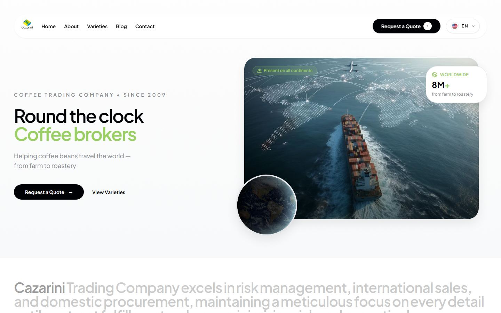
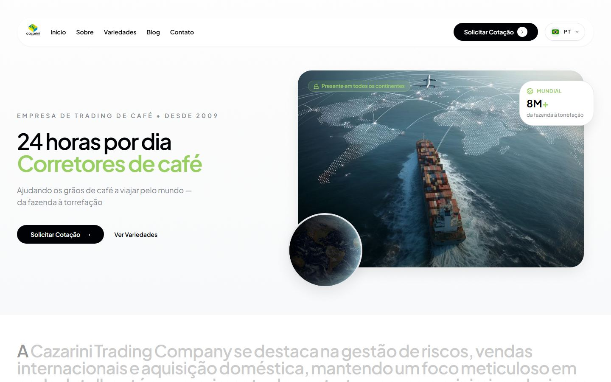
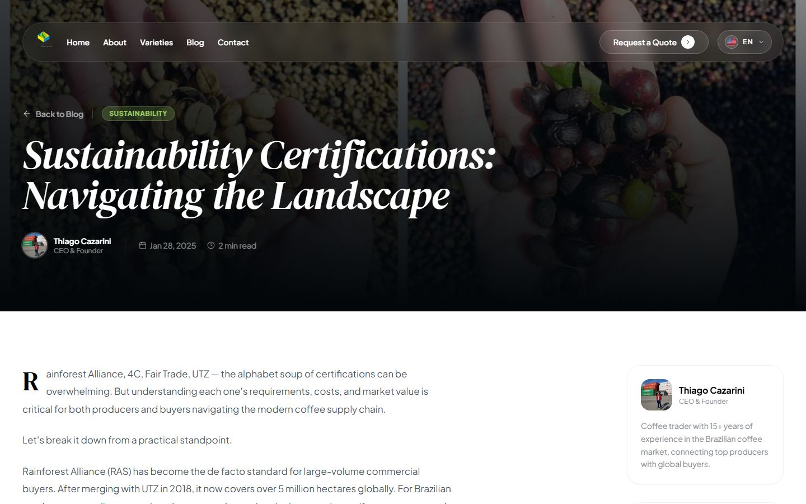
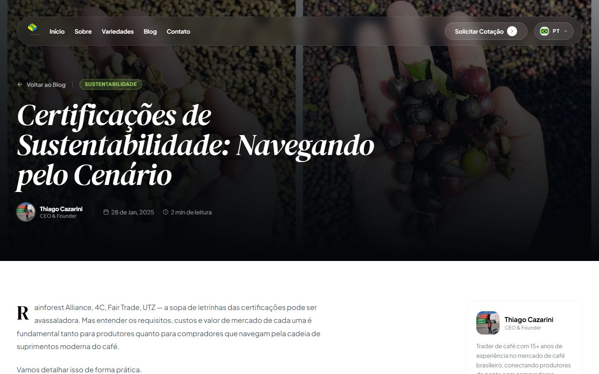

# Cazarini Coffee Trading

**🔗 Live site: [cazarini.vercel.app](https://cazarini.vercel.app/)**

Marketing and lead-generation website for Cazarini Trading Company, a Brazilian coffee brokerage based in Varginha, Minas Gerais, connecting coffee producers, exporters, and buyers worldwide. Fully bilingual (English / Portuguese) — including a dedicated, crawlable URL per language for every page and every blog post — built with React, Vite, and Tailwind CSS.

|                              Home (English)                               |                              Home (Português)                              |
| :-------------------------------------------------------------------------: | :--------------------------------------------------------------------------: |
|  |  |

|                            Blog post (English)                            |                            Blog post (Português)                            |
| :-------------------------------------------------------------------------: | :---------------------------------------------------------------------------: |
|  |  |

## Features

- **Real bilingual routing, not a client-side toggle.** Every page has its own URL per language (`/qualities` ↔ `/qualidades`, `/blog/:slug` ↔ `/blog/pt-br/:slug`, ...), and the language shown is derived from the URL itself — so a cold visit (no cookies, any search engine or AI crawler) renders the correct language deterministically, and `hreflang` tags point at real, working alternates instead of lying about a client-only preference.
- **A working lead funnel.** The contact form (with a buyer/producer-specific schema validated by Zod) posts to Formspree, which emails the sales inbox directly — backed by a honeypot field to silently drop bot submissions.
- **SEO/GEO hardening**: per-route Open Graph/Twitter tags, JSON-LD (`Organization`, `FAQPage`, `BlogPosting`), a hand-maintained `sitemap.xml` covering every bilingual URL pair, and a `robots.txt`/`llms.txt` that explicitly welcome AI answer-engine crawlers (GPTBot, ClaudeBot, PerplexityBot, Google-Extended).
- **GSAP-driven motion** throughout (entrance timelines, scroll-triggered reveals) without sacrificing first-load correctness.
- **Google Analytics 4** wired up with a `generate_lead` conversion event on successful form submission (drop in your own Measurement ID — see [Analytics](#analytics)).

## Architecture highlight: URL-driven language

Most "bilingual" SPAs just swap copy based on a `localStorage` flag — which means a search engine (or anyone without that flag set) only ever sees one language, no matter which URL it requests. This project makes the **URL itself the source of truth**:

- [`src/utils/localeRoutes.js`](src/utils/localeRoutes.js) — a small, pure-function module mapping every bilingual route pair (static pages *and* the dynamic `/blog/:slug` ↔ `/blog/pt-br/:slug` pattern), with no slug translation table to maintain.
- [`src/components/LanguageRouteSync.jsx`](src/components/LanguageRouteSync.jsx) — mounted once inside the router; on every navigation it derives the correct language from the current path and corrects the app's language context if they disagree, using `useLayoutEffect` so the correction lands before paint.
- [`src/components/Header.jsx`](src/components/Header.jsx) — the language toggle navigates to the sibling URL (via `getAlternatePath`) instead of just flipping a flag, so the URL and the rendered language can never drift apart.
- [`src/components/SEO.jsx`](src/components/SEO.jsx) — reads the same `localeRoutes` module to emit accurate `hreflang` alternates per route.

Unit tests for the routing logic live in [`src/utils/localeRoutes.test.js`](src/utils/localeRoutes.test.js).

## Tech stack

- **React 19** + **Vite 7** — UI and build tooling
- **React Router 7** — client-side routing, with parallel English/Portuguese URLs for every page and blog post
- **Tailwind CSS 3** — styling, with project-specific design tokens in `tailwind.config.js`
- **GSAP** (+ `ScrollTrigger`) — scroll-triggered entrance animations
- **react-hook-form** + **zod** — contact form state and validation
- **Vitest** + **React Testing Library** — unit/component tests
- **lucide-react** — icon set

## Getting started

```bash
npm install        # install dependencies
npm run dev         # start the dev server (Vite, with HMR)
npm run build        # production build to dist/
npm run preview      # preview the production build locally
npm run lint        # run ESLint
npm run test         # run the test suite once
npm run test:watch   # run the test suite in watch mode
```

## Project structure

```
src/
  components/        # shared/reusable sections (Hero, Header, Footer, Stats, FAQ, ...)
  pages/             # route-level pages (Home, Qualities, Blog, Contact, legal pages, ...)
  translations/      # en.json / pt-br.json — all user-facing copy
  context/           # LanguageContext (current language + the t() translation function)
  hooks/             # useTranslation, useGsapFadeIn, etc.
  data/              # static content data (blog posts, with full pt-BR translations)
  utils/             # localeRoutes, seoSchemas, analytics — pure helpers, unit-tested
public/
  photos/            # images served as-is
  sitemap.xml, robots.txt, llms.txt
docs/
  screenshots/       # README screenshots
```

## Internationalization (i18n)

All user-facing copy lives in `src/translations/en.json` and `src/translations/pt-br.json`, with matching nested keys in both files. Components read strings via the `useTranslation()` hook:

```jsx
import { useTranslation } from "../hooks/useTranslation";

const { t } = useTranslation();
t("hero.title"); // resolves to the current language's value at that key path
```

`LanguageContext` tracks the active language (persisted to `localStorage`) and exposes `t()`. If a key is missing in the current language, `t()` logs a warning and returns the key itself rather than throwing, so a missing translation never breaks the page. The active language itself is kept in sync with the URL by `LanguageRouteSync` (see [Architecture highlight](#architecture-highlight-url-driven-language) above) — not just `localStorage`.

Blog posts (`src/data/blogPosts.js`) carry both languages inline per post (`title`/`titlePt`, `content`/`contentPt`, etc.) rather than duplicating post objects, since EN/PT share the same slug under different URL prefixes.

## SEO

`src/components/SEO.jsx` is mounted per-page and manages `<title>`, meta description/keywords, Open Graph and Twitter Card tags, canonical URL, `hreflang` alternate links (`en` / `pt-BR` / `x-default`), and an optional JSON-LD structured-data payload (`Organization`/`FAQPage` on the home page, `BlogPosting` on every blog post — see `src/utils/seoSchemas.js`). `public/sitemap.xml` lists every bilingual URL pair, including all blog posts. `public/robots.txt` explicitly allows GPTBot, ClaudeBot, PerplexityBot, and Google-Extended, and `public/llms.txt` gives AI answer engines a lightweight orientation index.

This is a client-side-rendered SPA (no SSR/SSG), so all of the above is injected via JavaScript after the initial HTML loads — fine for Googlebot, but a known limitation for crawlers that don't execute JS. Worth revisiting with a prerendering step if organic blog traffic becomes a priority.

## Analytics

`index.html` includes a Google Analytics 4 (`gtag.js`) snippet with a placeholder Measurement ID (`G-XXXXXXXXXX`). To activate it:

1. Create a GA4 property at [analytics.google.com](https://analytics.google.com) and copy its Measurement ID.
2. Replace both occurrences of `G-XXXXXXXXXX` in `index.html`.

`src/utils/analytics.js` exposes `trackEvent(name, params)`, already wired to fire a `generate_lead` event whenever the contact form (on the Contact page or the homepage's inline section) submits successfully — safe to call even before a real ID is in place, since it no-ops until `window.gtag` exists.

## Testing

`npm run test` runs the Vitest suite (jsdom environment, React Testing Library). Coverage is intentionally a smoke-test layer rather than exhaustive: the bilingual routing logic (`localeRoutes`), the language context (`toggleLanguage`, key resolution/fallback), and the contact form (validation errors, a full successful submission against a mocked `fetch`, and the honeypot bailing out before any network call).

## Deployment

Deployed on Vercel (see `vercel.json`) as a static SPA build: `npm run build` outputs to `dist/`, and all routes rewrite to `index.html` so client-side routing works on direct/refresh navigation.

## License / ownership

This is commercial work built for Cazarini Trading Company — the code here is shared as a portfolio reference, not under an open-source license.

## Author

Built by [Pâmela Ascef Cazarini](https://www.linkedin.com/in/pamelaascefcazarini/).
